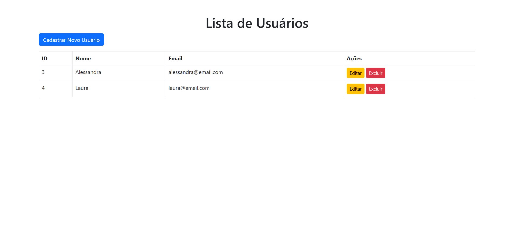
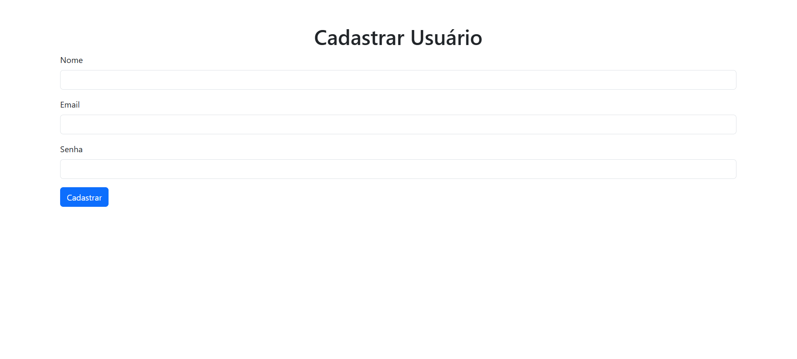
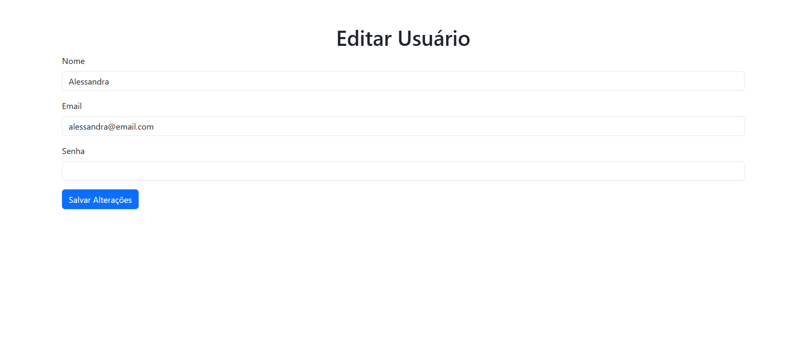

# Projeto: API de CRUD de Usuários com Frontend em HTML e Bootstrap

Este projeto consiste em uma API desenvolvida com Flask para gerenciar usuários e um frontend simples em HTML e Bootstrap para consumir a API.

---





---

## 📋 Funcionalidades

### Backend (API)
- **Cadastrar Usuário**: Endpoint para cadastrar um novo usuário no banco de dados.
- **Listar Usuários**: Endpoint para listar todos os usuários cadastrados.
- **Atualizar Usuário**: Endpoint para atualizar os dados de um usuário.
- **Excluir Usuário**: Endpoint para remover um usuário do banco de dados.
- **Obter Usuário por ID**: Endpoint para buscar os dados de um usuário específico.

### Frontend
- **Formulário de Cadastro**: Permite cadastrar novos usuários.
- **Lista de Usuários**: Exibe os usuários cadastrados em uma tabela com opções para editar ou excluir.
- **Formulário de Edição**: Permite editar os dados de um usuário.

---

## 🛠️ Tecnologias Utilizadas

### Backend
- **Python**: Linguagem de programação.
- **Flask**: Framework para desenvolvimento da API.
- **Flask-CORS**: Para lidar com problemas de CORS.
- **MySQL**: Banco de dados para armazenar os dados dos usuários.
- **bcrypt**: Para hashing de senhas.
- **python-dotenv**: Para gerenciar variáveis de ambiente.

### Frontend
- **HTML**: Estrutura da página.
- **Bootstrap**: Estilização e layout responsivo.
- **Axios**: Biblioteca para realizar requisições HTTP.

---

## 🚀 Como Executar o Projeto

### Pré-requisitos
- Python 3.10 ou superior instalado.
- MySQL instalado e configurado.

### Configuração do Banco de Dados

1. **Crie o banco de dados e a tabela no MySQL executando as seguintes queries**:

   ```sql
   CREATE DATABASE usuarios;

   USE usuarios;

   CREATE TABLE usuario (
       id INT AUTO_INCREMENT PRIMARY KEY,
       nome VARCHAR(100) NOT NULL,
       email VARCHAR(100) NOT NULL,
       senha VARCHAR(255) NOT NULL
   );
   ```

2. **Configure as variáveis de ambiente no arquivo `.env`**:
   ```
   DB_HOST=localhost
   DB_USER=seu_usuario
   DB_PASSWORD=sua_senha
   DB_NAME=sistema_usuario
   ```

---

### Configuração do Backend

1. **Clone o repositório**:
   ```bash
   git clone <URL_DO_REPOSITORIO>
   cd backend
   ```

2. **Instale as dependências**:
   ```bash
   pip install -r requirements.txt
   ```

3. **Execute o backend**:
   ```bash
   python app.py
   ```

4. **O backend estará disponível em http://127.0.0.1:5000**.

---

### Configuração do Frontend

1. **Acesse a pasta do frontend**:
   ```bash
   cd frontend
   ```

2. **Abra o arquivo `index.html` no navegador**.

---

## 📚 Endpoints da API

### 1. **Cadastrar Usuário**

- **URL**: `/usuarios`
- **Método**: `POST`
- **Body**:
  ```json
  {
    "nome": "João",
    "email": "joao@email.com",
    "senha": "senha123"
  }
  ```
- **Resposta**:
  ```json
  {
    "message": "Usuário cadastrado com sucesso!"
  }
  ```

---

### 2. **Listar Usuários**

- **URL**: `/usuarios`
- **Método**: `GET`
- **Resposta**:
  ```json
  [
    {
      "id": 1,
      "nome": "João",
      "email": "joao@email.com"
    },
    ...
  ]
  ```

---

### 3. **Obter Usuário por ID**

- **URL**: `/usuarios/<id>`
- **Método**: `GET`
- **Resposta**:
  ```json
  {
    "id": 1,
    "nome": "João",
    "email": "joao@email.com"
  }
  ```

---

### 4. **Atualizar Usuário**

- **URL**: `/usuarios/<id>`
- **Método**: `PUT`
- **Body**:
  ```json
  {
    "nome": "João Atualizado",
    "email": "joao_atualizado@email.com",
    "senha": "nova_senha123"
  }
  ```
- **Resposta**:
  ```json
  {
    "message": "Usuário atualizado com sucesso!"
  }
  ```

---

### 5. **Excluir Usuário**

- **URL**: `/delete/<id>`
- **Método**: `DELETE`
- **Resposta**:
  ```json
  {
    "message": "Usuário excluído com sucesso!"
  }
  ```

---

## 🐛 Possíveis Problemas e Soluções

1. **Erro de CORS**:
   - Certifique-se de que o `flask-cors` está instalado e configurado no backend.

2. **Erro ao Conectar ao Banco de Dados**:
   - Verifique as credenciais no arquivo `.env`.
   - Certifique-se de que o MySQL está rodando.

3. **Erro 404 nos Endpoints**:
   - Verifique se o backend está rodando e se a URL base está correta.